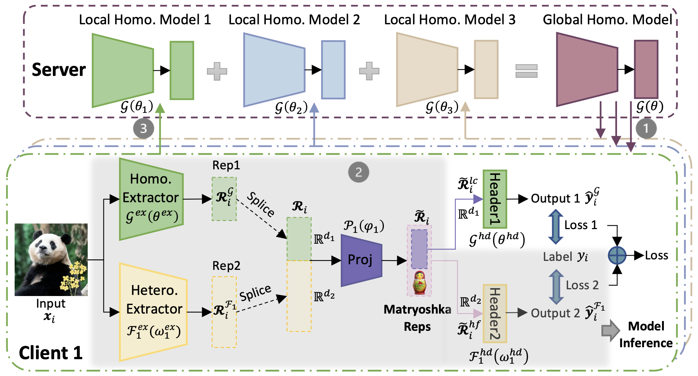

## Federated Model Heterogeneous Matryoshka Representation Learning
This is an official implementation of ***[Federated Model Heterogeneous Matryoshka Representation Learning](https://arxiv.org/abs/2406.00488)*** paper.



#### Installation
- Create a virtual environment with virtualenv
- Clone the repo
- Run: ```cd <PATH_TO_THE_CLONED_REPO>```
- Run: ```pip install -r requirements.txt``` to install necessary packages.

---------

#### Reproduce Paper Results
- Model-homogeneous experiment: ```FedMRL_homo.py ```
- Model-heterogeneous experiment: ```FedMRL_hetero.py ```
---------


#### Citation

If you find FedMRL to be useful in your own research, please consider citing the following bibtex:

```bib
@inproceedings{FedMRL,
  author    = {Liping Yi and Han Yu and Chao Ren and Gang Wang and Xiaoguang Liu and Xiaoxiao Li},
  title     = {{Federated Model Heterogeneous Matryoshka Representation Learning}},
  booktitle = {NeurIPS},
  year      = {2024},
}
```
